## **MAIN IDEA**
> An experiment for the remarkable2 that watches what you write and, when prompted either with a gesture or some on-screen content, can write back to the screen. This is an exploration of various interacts through this handwriting+screen medium.

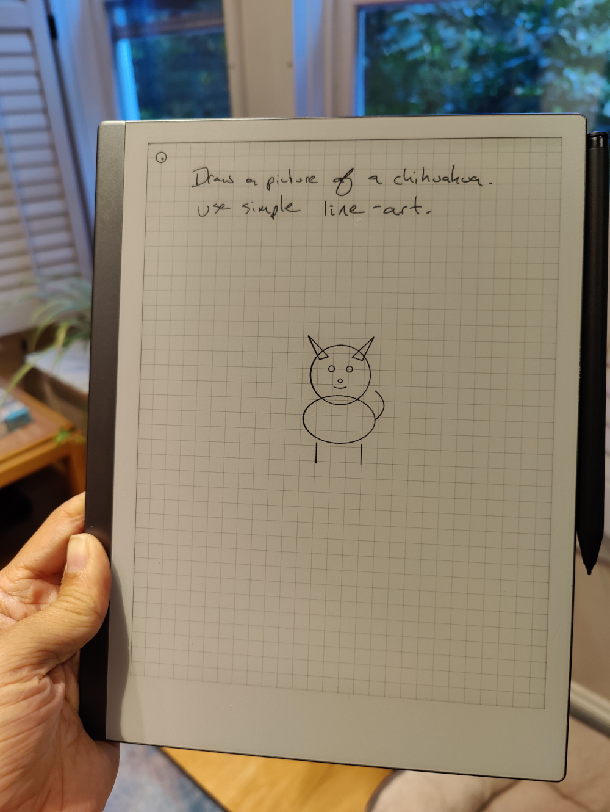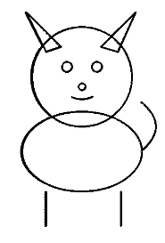

<b><i>I wrote the handwritten prompt, GPT-4o drew the Chihuahua!!!</i></b>

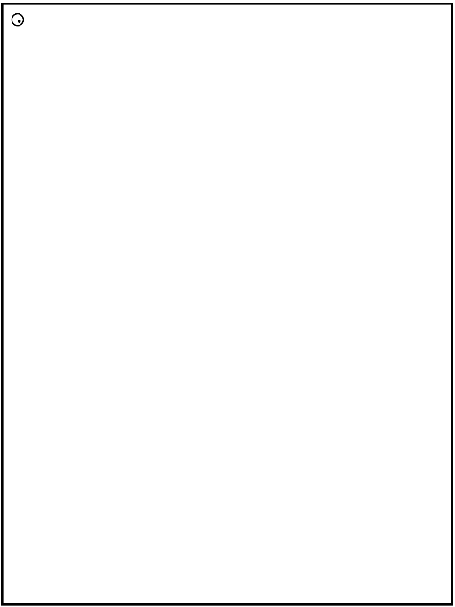

## Setup/Installation

You need an `OPENAI_API_KEY` (or similar for other models) environment variable set. I did this by adding it to my ~/.bashrc file on the remarkable:

```sh
# In the remarkable's ~/.bashrc or before you run ghostwriter, set one or more of your keys
export OPENAI_API_KEY=your-key-here
export ANTHROPIC_API_KEY=your-key-here
export GOOGLE_API_KEY=your-key-here
```

Install by getting the binary to your remarkable. On your not-remarkable:

```sh
wget https://github.com/awwaiid/ghostwriter/releases/latest/download/ghostwriter

# Replace this ip address with your remarkable ip address
scp ghostwriter root@192.168.1.117:
```

Then you have to ssh over and run it. Here is how to install and run (run these on the remarkable):

```sh
# One itme -- make it executable after the initial copy
chmod +x ./ghostwriter

./ghostwriter --help # Get the options and see that it runs at all
```

## Usage

First you need to start `ghostwriter` on the reMarkable. SSH into your remarkable and run:
```
# Use the defaults, including claude-3-5-sonnet
./ghostwriter

# Use ChatGPT with the gpt-4o-mini model
./ghostwriter --model gpt-4o-mini
```

Draw some stuff on your screen, and then trigger the assistant by *touching/tapping the upper-right corner with your finger*. In the ssh session you'll see other touch-detections and there is a log of what happens while it is processing. You should see some dots drawn during processing and then a typewritten or drawn response!

## Status / Journal
* **2024-10-06** - Bootstrapping
  * Basic proof of concept works!!!
  * Drawing back on the screen doesn't work super well; it takes the SVG output from ChatGPT and rasterizes it and then tries to draw lots of individual dots on the screen. The Remarkable flips out a bit ... and when the whole screen is a giant black square it really freaks out and doesn't complete
  * Things that worked at least once:
    * Writing "Fill in the answer to this math problem... 3 + 7 ="
    * "Draw a picture of a chihuahua. Use simple line-art"
* **2024-10-07** - Loops are the stuff of souls
  * I got a rudimentary gesture and status display!
  * So now you can touch in the upper-right and you get an "X" drawn. Then as the input is processed you get further crosses through the X. You have to erase it yourself though :)
* **2024-10-10** - Initial virtual keyboard setup
  * I've started to learn about using the Remarkable with a keyboard, something that I hadn't done before. It's surprisingly limited ... there is basicaly one large textarea for each page with some very basic formatting
  * To write in that I have to make a pretend keyboard, which we can do via rM-input-devices, and I've done basic validation that it works!
  * So now I want to introduce a mode where it always writes back to the text layer and recognizes that text comes from Machine and hadwriting from Human. Not sure that I'll like this mode
* **2024-10-20** - Text output and other modes
  * Slowly starting to rework the code to be less scratch-work, organized a bit
  * Now introduced `./ghostwriter text-assist` mode, uses a virtual keyboard to respond!
* **2024-10-21** - Binary release build
  * Got a github action all set to do binary builds
* **2024-10-23** - Code shuffle
  * Doing a bit of refactoring, grouping utilities into separate files
  * Yesterday a new Anthropic model came out (3.5-sonnet-new) which might be better at spacial awareness on the screen, so next up is to try that out in drawing-mode
  * In any case, next I want to set it up with `tools` so that it can contextually give back an SVG or text or start to trigger external scripts, like for TODO list management
* **2024-11-02** - Tool Time
  * Switch to providing some tools -- draw_text and draw_svg
  * This should make it more compatible with Anthropic?
  * More immediately, this means now there is the one overall assistant and it decides to draw back keyboard text or SVG drawing
* **2024-11-07** - Claude! (Anthropic)
  * More shuffling to start to isolate the API
  * ... and now I added Claude/Anthropic!
  * It is able to use an almost identical tool-use setup, so I should be able to merge the two
  * So far it seems to like drawing a bit more, but it is not great at drawing and not much better at spacial awareness
  * Maybe next on the queue will be augmenting spacial awareness through some image pre-processing and result positioning. Like detect bounding boxes, segments, etc, feed that into the model, and have the model return an array of svgs and where they should be positioned. Maybe.
* **2024-11-22** - Manual Evaluations
  * Starting to sketch out how an evaluation might work
  * First I've added a bunch of parameters for recording input/output
  * Then I use that to record a sample input and output on the device
  * Then I added support to run ghostwriter on my laptop using the pre-captured input (build with `./build.sh local`)
  * Next I will build some tooling around iterating on examples given different prompts or pre-processing
  * And then if I can get enough examples maye I'll have to make an AI judge to scale :)
  * To help with that ... on idea is to make overlay the original input with the output but make the output a different color to make it differentiable by the judge
  * So far this technique is looking good for SVG output, but it'd be nice to somehow render keyboard output locally too. That is tricker since the keyboard input rendering is done by the reMarkable app
* **2024-12-02** - Initial segmenter
  * With a LOT of help from claude/copilot I have added a basic image segmenting step
  * This does some basic segmenting and then gives the segment coordinates to the VLM to consider
  * Only hooked it up with claude for now, need to merge those two models
  * ... It helps with putting X in boxes a LOT!!<br/>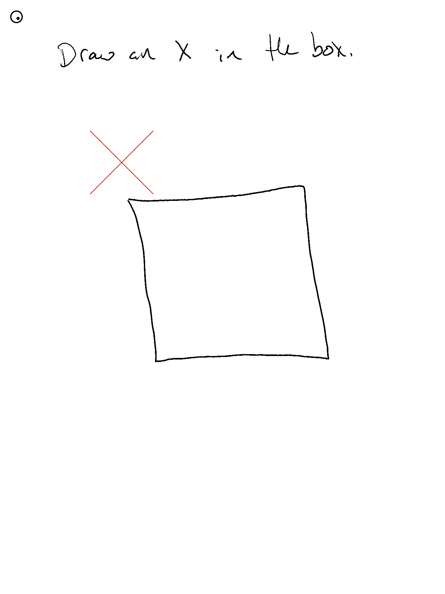 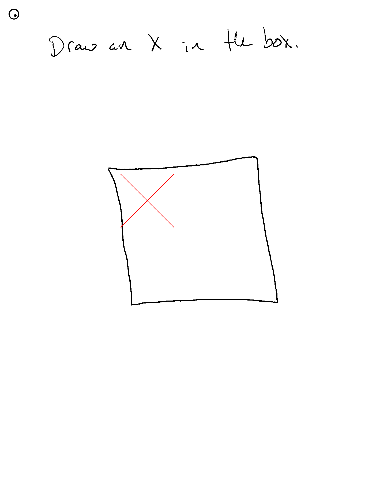
  * Need to get some automation around the evaluations
  * The segmenter has to be explicitly enabled with `--apply-segmentation` and it assumes that you have either `--input-png` or `--save-screenshot` because it (dumbly) re-parses the png file
  * OMG this is the first time that the math prompt got even close to putting the answer where I want! It has been getting it right, but usually types the `10` with the keyboard or places it somewhere wrong. This time it actually put it where it should be!<br/>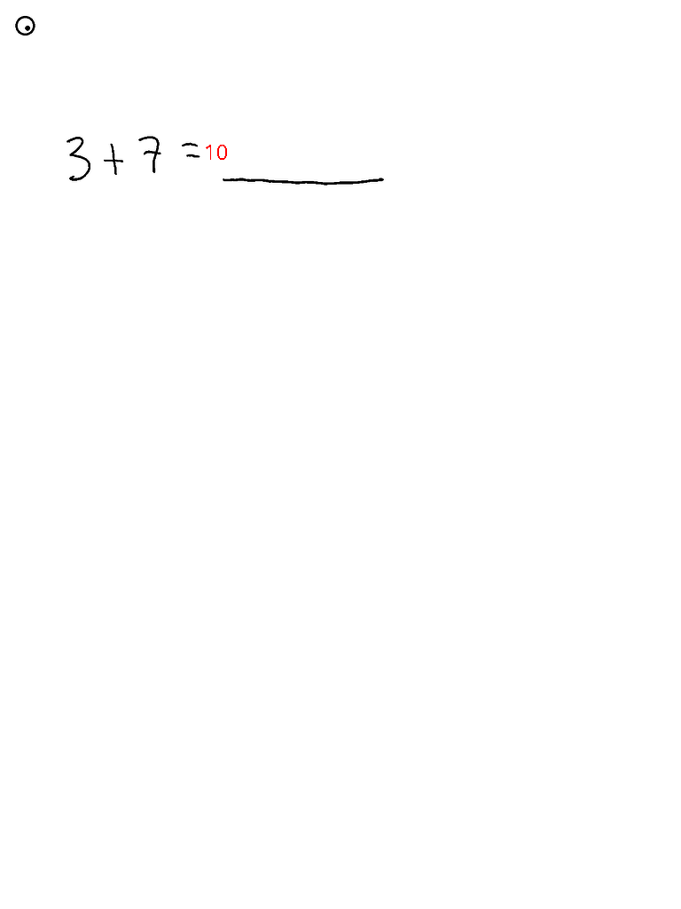
* **2024-12-15** - Engine Unification
  * With the usual help from claude/copilot and some tutorials I extracted out some polymorphic engine layer for OpenAI and Anthropic backends
  * So now you can pass in engine and model
  * A lot of other codebases take a model and then do a map; maybe I'll do that based on the model name or something
  * I also got the prompt and tool definitions externalized (into a `prompts/` directory) and unified, so each engine does whatever it needs to adjust for its own API
  * In theory the `prompts/` files are both bundled in the executable AND overridable at runtime with a local directory, but I haven't verified that much
* **2024-12-18** - System Upgrade Panic
  * I auto-update my remarkable, usually fine
  * But I just got 3.16.2.3 and ... screenshots stopped working!
  * So I used [codexctl](https://github.com/Jayy001/codexctl) to downgrade. It gave me a VERY scary "SystemError: Update failed!" and then the whole system locked up!
  * ... but a reboot fixed it and the downgrade to 3.14.1.9 worked upon reboot
  * So... I'm keeping an eye out for other reports of issues on the new version
  * Oh yes. Now you can take prompts/general.json, rename it to `james.json` and go in and add "Your name is James" into the prompt. Then copy that to your reMarkable
  * Now run `./remarkable --prompt james.json` and it has a locally modified prompt!<br/>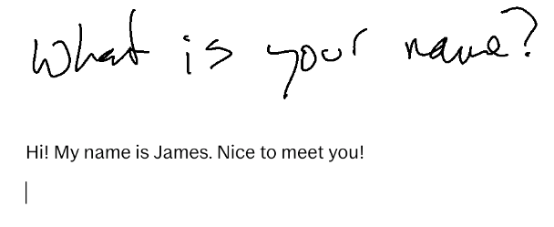
* **2024-12-19** -- Not Quite Local
  * On the internet they suggested a local-network VLM mode
  * Ollama has that! So I tried...
  * But it says that llama3.2-vision doesn't have tools :(
  * But Groq llama-3.2 does!
  * ... but it is not very good at tic-tac-toe (this is the 90b). Though it is very fast!<br/>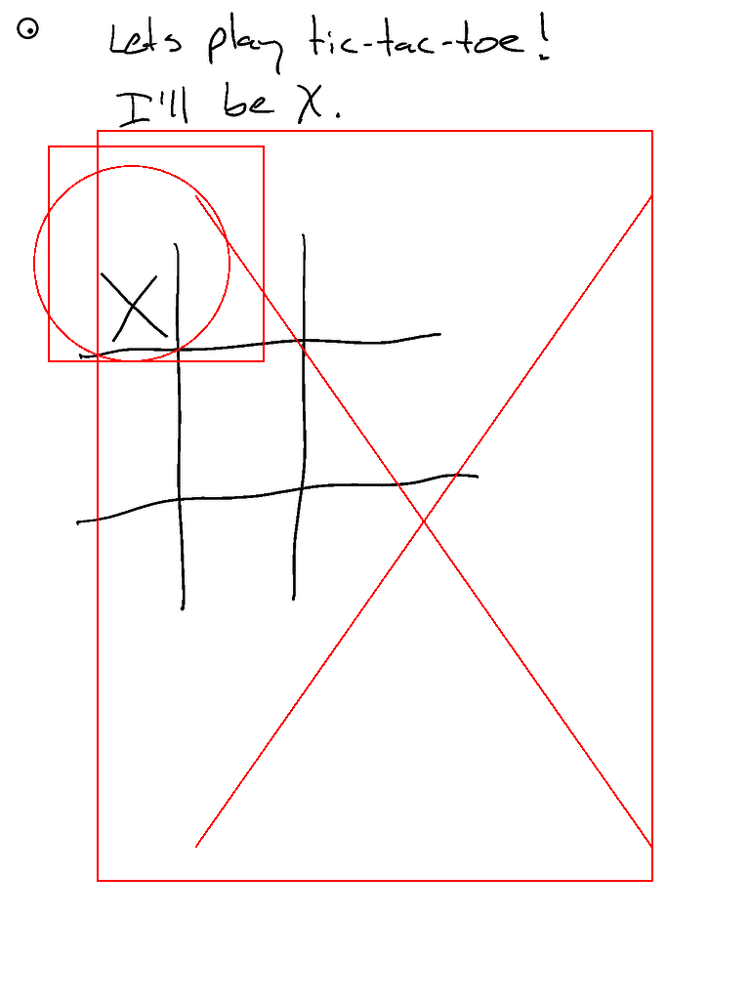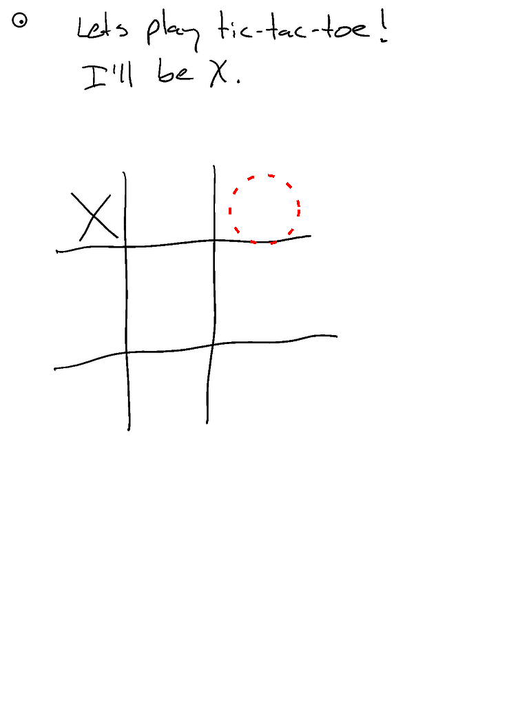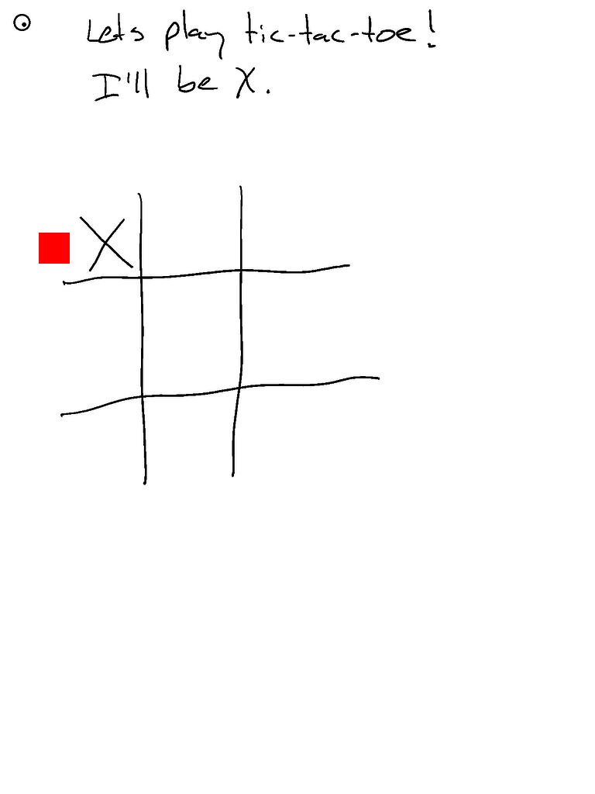
  * Oops! I forgot to turn on segmentation. Here it is with that enabled which should give a better sense of space...<br/>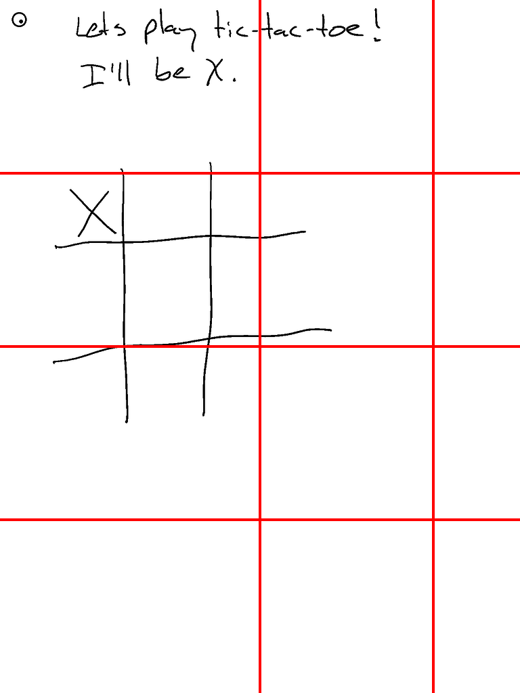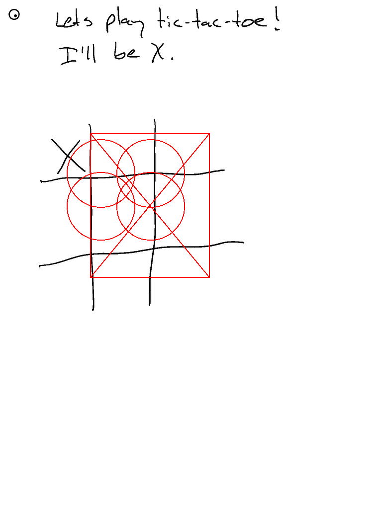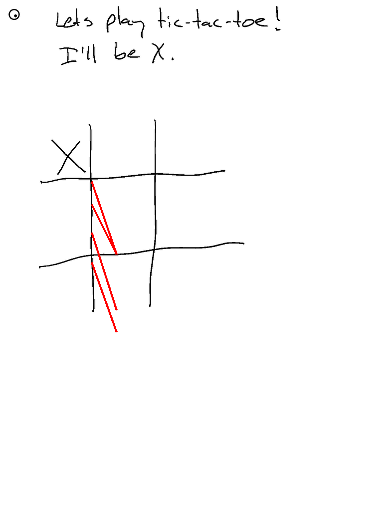
  * Here are 3 runs from claude in contrast<br/>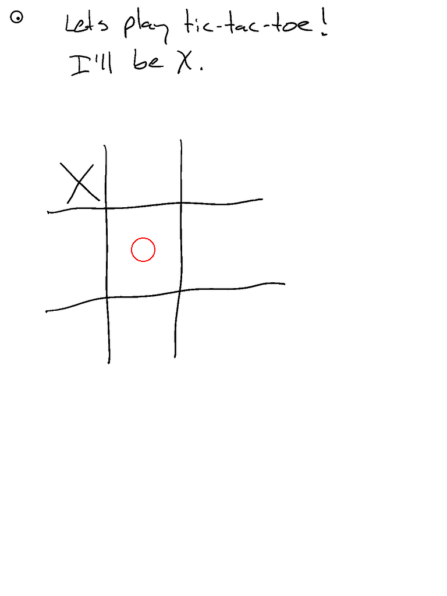
  * Well. The new ENV is `OPENAI_BASE_URL`, so `OPENAI_BASE_URL=https://api.groq.com/openai ./ghostwriter --engine openai --model llama-3.2-90b-vision-preview` for example
* **2024-12-22** -- Starting to Evaluate
  * Starting to build out the evaluation system a bit more, including a [basic script to kick it all off](run_eval.sh)
  * Right now it is a hard-wired set of parameters which basically turn on/off segmentation and use either Claude 3.5 Sonnet or ChatGPT 4o-mini
  * See [the initial evaluation report](evaluation_results/2024-12-21_13-57-31/results.md)!
  * I think markdown doesn't let me lay this out how I want, so will probably switch to html (maybe turn on github site hosting for it)
  * This is starting to get into the terratory where it can take some time and money to execute ... running this a bunch of times and I sent like $1. Not sure how long it took. but there were 48 executions in this final report
  * Oh -- I think it's rather important to run each set a few times assuming there is some temperature involved
  * To scale this even further we of course would want to bring in a JUDGE-BOT!
  * Then I could say things like "my new segmentation algorithm improved output quality by 17% per the JUDGE-BOT" etc
* **2024-12-25** -- CLI simplify and expand
  * Now you can pass just `-m gpt-4o-mini` and it will guess the engine is `openai`
  * You can also pass `--engine-api-key` and `--engine-url-base`
  * So now to use [Groq](https://groq.com/): `./ghostwriter -m llama-3.2-90b-vision-preview --engine-api-key $GROQ_API_KEY --engine openai --engine-base-url https://api.groq.com/openai`
  * ... but so far Llama 3.2 90b vision is still quite bad with this interface
  * I turned off a bunch of debugging. Now I'll need to go back and introduce log-level or something
  * BONUS: And now I've added Google Gemini! Try `-m gemini-2.0-flash-exp` with your `GOOGLE_API_KEY` set!<br />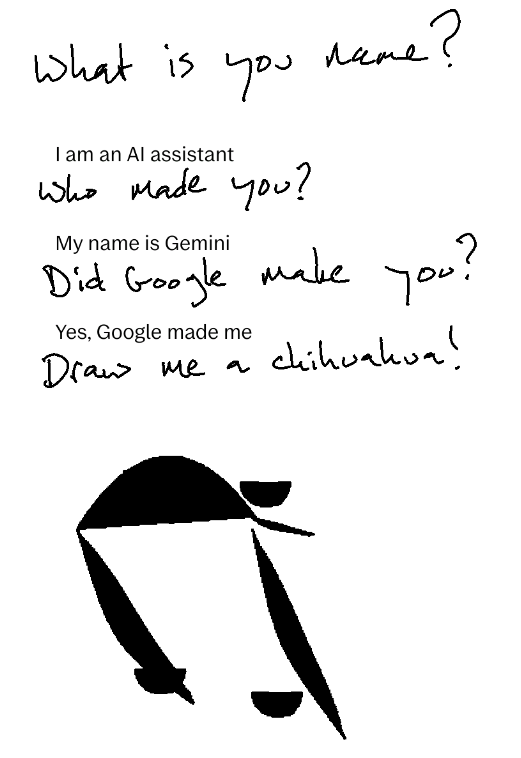
* **2024-12-28** -- Usability
  * I used a powered usb-hub to get an external keyboard plugged in, trying to see what sort of keyboard shortcuts we might have
  * That helped to get a further sense for where the keyboard input goes
  * So now I'm sending an extra touch-event in the bottom-center of the screen which will make the next keyboard input always go below the lowest element, which is what I wanted. Before it would go below the most recent typed text, so if you drew under that it would get confusing. Before, the answer to "what is your favorite color?" would have been placed directly below the first typed output; now it is nice and neatly put lower down! Also I guess this is a dream-bubble of a sheep?<br />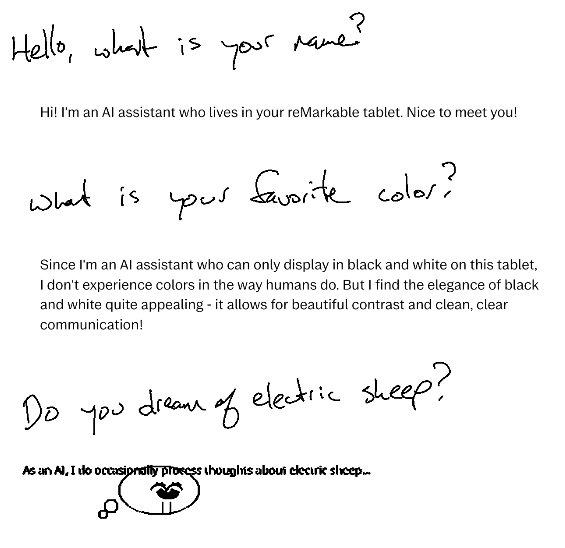

## Ideas
* [DONE] Matt showed me his iOS super calc that just came out, take inspiration from that!
  * This already kinda works, try writing an equation
* [DONE] A gesture or some content to trigger the request
  * like an x in a certain place
  * or a hover circle -- doesn't need to be an actual touch event per se
* [DONE] Take a screenshot, feed it into a vision model, get some output, put the output back on the screen somehow
* [DONE] Like with actual writing; or heck it can draw a million dots on the screen if it does it fast
* [DONE] OK ... we can also send *keyboard* events! That means we can use the Remarkable text area. This is an awkward and weird text area that lives on a different layer from the drawing
  * So maybe we can say drawing = human, text = machine
  * Probably a lot easier to erase too...
* [DONE] Basic Evaluation
  * Create a set of screenshots for inputs
  * Represent different use-cases
  * Some of these, such as TODO-extraction, might have specific expectations for output or execution, but most of them won't
  * Run through the system to get example output -- text, svg, actions
  * Write a test suite to judge the results .... somewhat human powered? Separate VLM judge?
* [WIP] Prompt library
  * There is already the start of this in <a href="prompts/">prompts/</a>
  * The idea is to give a set of tools (maybe actual llm "tools") that can be configured in the prompt
  * But also could put in there some other things ... like an external command that gets run for the tool
  * Example: a prompt that is good at my todo list management. It would look for "todo", extract that into a todo, and then run `add-todo.sh` or something
    * (which would in turn ssh somewhere to add something to taskwarrior)
* Initial config
  * On first run, maybe create a config file
  * Could prompt for openai key and then write it into the file
  * Maybe an auto-start, auto-recovery?
* Generate Diagrams
  * Let one of the outputs be plantuml and/or mermaid, and then turn that into an SVG/png that it then outputs to the screen
* External stuff
  * Let it look things up
  * Let it send me stuff ... emails, slacks
* Conversation Mode
  * On a single screen, keep track of each version of the screen betweent turns
  * So first send would be the screen
  * Second send would be the original screen and then the response screen (maybe with claude output in red) and then the new additions (maybe in green?)
    * This could then be a whole chain for the page
    * Could have two separate buttons to trigger the VLM -- one for "new prompt" and one for "continue"
  * OR we could make it so that every time it was the last three:
    * Black: Original
    * Red: Claude response
    * Green: New input
  * Or could use the same color structure but a whole chain of messages?
  * Might be weird when we go to a new blank page though. It'd look like the new input erased everything
  * In general this would also make it easier to handle scrolling maybe
* Run off of a network-local VLM (like ollama)
  * First attempt at using the OpenAI-API compatible ollama failed; the ollama LLAMA 3.2 vision model doesn't support tools
  * Though Groq has a modified llama-3.2-vision that DOES have tools... but it isn't nearly as good as ChatGPT, Claude, or Gemini.

## References
* Generally pulled resources from [Awesome reMarkable](https://github.com/reHackable/awesome-reMarkable)
* Adapted screen capture from [reSnap](https://github.com/cloudsftp/reSnap)
* Techniques for screen-drawing inspired from [rmkit lamp](https://github.com/rmkit-dev/rmkit/blob/master/src/lamp/main.cpy)
* Super cool SVG-to-png done with [resvg](https://github.com/RazrFalcon/resvg)
* Make the keyboard input device even without a keyboard via [rM-input-devices](https://github.com/pl-semiotics/rM-input-devices)
* Not quite the same, but I recently found [reMarkableAI](https://github.com/nickian/reMarkableAI) that does OCR→OpenAI→PDF→Device
* Another reMarkable-LLM interface is [rMAI](https://github.com/StarNumber12046/rMAI). This one is a separate app (not trying to integrate in with simulated pen/keyboard input) and uses [replicate](https://replicate.com) as the model API service
* I haven't adopted anything from it yet, but [Crazy Cow](https://github.com/machinelevel/sp425-crazy-cow) is a cool/crazy tool that turns text into pen strokes for the reMarkable1

## Development

```sh
# Initial dependencies install (also ... rust, which I get via asdf)
rustup target add armv7-unknown-linux-gnueabihf
sudo apt-get install gcc-arm-linux-gnueabihf
cargo install cross

# Then to build
cross build --release --target=armv7-unknown-linux-gnueabihf

# And deploy by scp'ing the binary over and run it on the device!
scp target/armv7-unknown-linux-gnueabihf/release/ghostwriter remarkable:
```

## Scratch Notes

```

# Record an evaluation on the device
./ghostwriter --output-file tmp/result.out --model-output-file tmp/result.json --save-screenshot tmp/input.png --no-draw-progress --save-bitmap tmp/result.png claude-assist

# On local, copy the evaluation to local and then put it into a folder
export evaluation_name=tic_tac_toe_1
rm tmp/*
scp -r remarkable:tmp/ ./
mkdir -p evaluations/$evaluation_name
mv tmp/* evaluations/$evaluation_name

# Run an evaluation
./target/release/ghostwriter --input-png evaluations/$evaluation_name/input.png --output-file tmp/result.out --model-output-file tmp/result.json --save-bitmap tmp/result.png --no-draw --no-draw-progress --no-loop --no-trigger claude-assist

# Layer the input and output
convert \( evaluations/$evaluation_name/input.png -colorspace RGB \) \( tmp/result.png -type truecolormatte -transparent white -fill red -colorize 100 \) -compose Over -composite tmp/merged-output.png
```

Prompt / Tool ideas:
* There are a few models for tools -- each tool can be re-usable and generalized or each tool could include things like extra-inputs for chain-of thought and hints for what goes into each parameter
* The prompts should be plain JSON or YAML and should be normalized across V/LLM models
* A general direction I'm thinking is to have top-level "modes" that each have a main prompt and a set of tools they can use
* But maybe there can be a whole state-machine flow that the follow also?
* So like ... a math-helper might have a different state-machine than a todo-helper
* The states would be start, intermediate, and terminal
* The terminal states should all have some output or effect, those are the ones that do something
* The start state is the initial prompt
* One intermediate state could be `thinking` where it can use the input of the tool as a place to write out thoughts, and the output of the tool is ignored
* But overall what we're leading to here is a system where the prompts are easy to write, easy to copy/paste, easy to maintain
* And then maybe we can have a set of evals or examples that are easy to use on top of a prompt mode
* Increasingly, the reMarkable2 case might HAPPEN to be a specific prompt we set up in this system...
* So the state machine chould be:

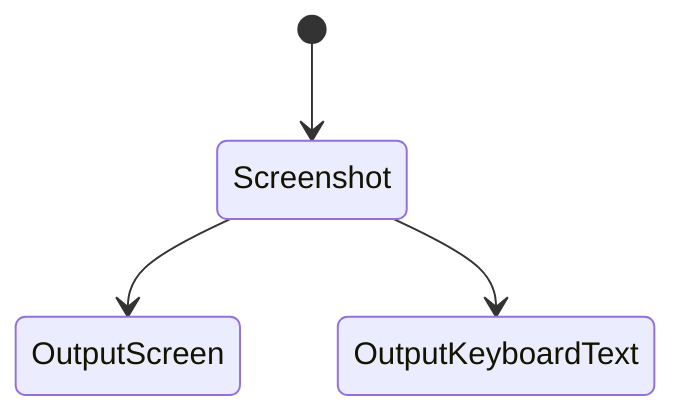
```mermaid
stateDiagram-v2
    [*] --> Screenshot
    Screenshot --> OutputScreen
    Screenshot --> OutputKeyboardText
```

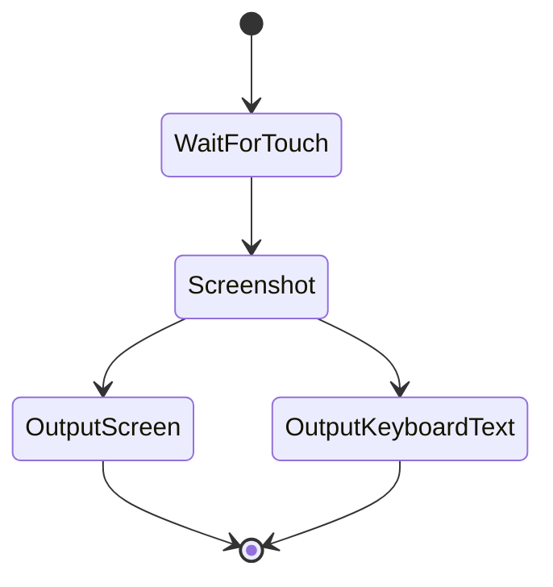
```mermaid
stateDiagram-v2
    [*] --> WaitForTouch
    WaitForTouch --> Screenshot
    Screenshot --> OutputScreen
    Screenshot --> OutputKeyboardText
    OutputScreen --> [*]
    OutputKeyboardText --> [*]
```

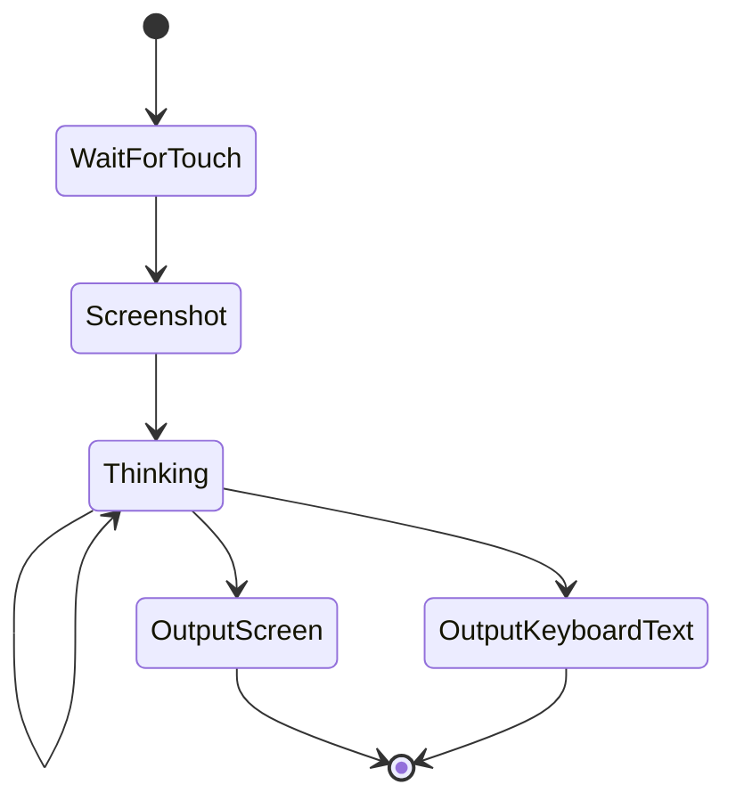
```mermaid
stateDiagram-v2
    [*] --> WaitForTouch
    WaitForTouch --> Screenshot
    Screenshot --> Thinking
    Thinking --> Thinking
    Thinking --> OutputScreen
    Thinking --> OutputKeyboardText
    OutputScreen --> [*]
    OutputKeyboardText --> [*]
```

